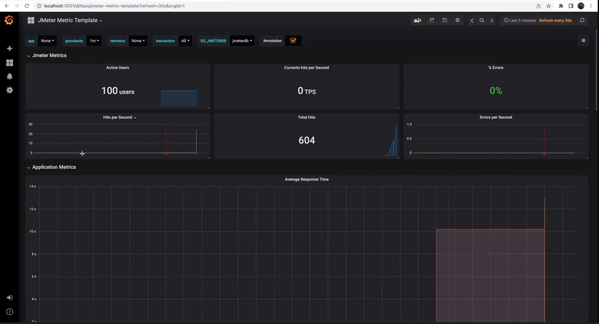

# Adding a new usecase
{: .no_toc }

Modify an existing template in Machmeter to implement a new use-case for Machmeter. To illustrate the process, in this
guide we will be walking through adding a new template for an ERP database on the basis of the existing financial-ledger
template.

{: .note }
While this guide focuses on adding a new machmeter template, the general process of developing load testing templates for
Cloud Spanner using JMeter is covered in the following article: [JMeter Spanner Performance Test](https://cloud.google.com/community/tutorials/jmeter-spanner-performance-test)
If you are having trouble following this guide and to develop the JMeter template, please refer to the above link
for additional information.

## Table of contents
{: .no_toc .text-delta }

1. TOC
{:toc}

## Pre-requisites

### Setting up Repository

* Sure that you are authenticated and have the right permissions configured before getting started.
  Follow [this](../requirements.md) guide to ensure that all permissions are in place.
* To set Machmeter up, first create a [fork]((https://docs.github.com/en/get-started/quickstart/fork-a-repo)) of the Machmeter repository. Use the following
   [instructions] to create a fork.
* Once a fork is setup, [clone](https://docs.github.com/en/get-started/quickstart/fork-a-repo#cloning-your-forked-repository) the project locally.

### Machmeter Dependencies

Ensure that the needed dependencies for Machmeter are installed. View the required dependencies [here](../requirements.md).

### JMeter Local Setup

While Machmeter itself does not require a local Jmeter installation and abstracts out the details of setting up JMeter
from the user, for adding a new template, the JMeter UI is very helpful. 

It allows the user to quickly open, edit and test the template before it is run at massive scale on a GKE cluster.

To install JMeter locally, follow the
instructions [here](https://cloud.google.com/community/tutorials/jmeter-spanner-performance-test#:~:text=with%20the%20tests.-,Installation,-Download%20and%20install)
add link. For this guide, we will assume that jMeter can be booted up locally by running `jmeter` command on the CLI.

## Identify the template to modify

Machmeter has a number of starter templates are present in
the [usecases](https://github.com/cloudspannerecosystem/machmeter/tree/master/machmeter/usecases) directory.
Browse through the list of templates to identify a template closest to what you are looking for. 

Each template folder contains a `.txt` file with the description of what the template does. 
We will use this template as the basis to create our new template.

## Create a new folder and clone the contents

Create a new folder in the machmeter `usecases` directory, and clone the contents of your picked usecase into it:

```shell
cd machmeter/usecases
 mkdir -p erp/employees
 cp -r finance/ledger/* erp/employees/
 ls 
```

A new usecase folder hierarchy `erp/employees` is created in the `usecases` directory with the contents of the
`finance/ledger` folder. Verify that that it contains two-subfolders: `sample-configs` and `templates`.

## Modify the schema

```shell
cd erp/employees/sample-configs
ls 
```

The [schema](https://github.com/cloudspannerecosystem/machmeter/blob/master/machmeter/usecases/finance/ledger/templates/schema.sql)
file describes the database DDL. Machmeter reads this file to create the DDL on the Cloud Spanner instance you supply
during machmeter `setup` command execution.
For our `erp/employees` use-case, we will replace the existing file contents from `financial/leger` use-case with our
new schema.

Open the `schema.sql` file in the editor of your choice, and replace its contents with the following:

```sql
CREATE TABLE departments (
  dept_no STRING(4) NOT NULL,
  dept_name STRING(40) NOT NULL,
) PRIMARY KEY(dept_no);

CREATE UNIQUE INDEX dept_name ON departments(dept_name);

CREATE TABLE dept_manager (
  dept_no STRING(4) NOT NULL,
  emp_no INT64 NOT NULL,
  from_date DATE NOT NULL,
  to_date DATE NOT NULL,
) PRIMARY KEY(dept_no, emp_no),
  INTERLEAVE IN PARENT departments ON DELETE NO ACTION;

CREATE INDEX dept_no_17 ON dept_manager(dept_no);

CREATE INDEX emp_no_18 ON dept_manager(emp_no);

CREATE TABLE employees (
  emp_no INT64 NOT NULL,
  birth_date DATE NOT NULL,
  first_name STRING(14) NOT NULL,
  last_name STRING(16) NOT NULL,
  gender STRING(MAX) NOT NULL,
  hire_date DATE NOT NULL,
) PRIMARY KEY(emp_no);

CREATE TABLE dept_emp (
  emp_no INT64 NOT NULL,
  dept_no STRING(4) NOT NULL,
  from_date DATE NOT NULL,
  to_date DATE NOT NULL,
) PRIMARY KEY(emp_no, dept_no),
  INTERLEAVE IN PARENT employees ON DELETE NO ACTION;

CREATE INDEX dept_no ON dept_emp(dept_no);

CREATE INDEX emp_no_13 ON dept_emp(emp_no);

CREATE TABLE salaries (
  emp_no INT64 NOT NULL,
  salary INT64 NOT NULL,
  from_date DATE NOT NULL,
  to_date DATE NOT NULL,
) PRIMARY KEY(emp_no, from_date),
  INTERLEAVE IN PARENT employees ON DELETE NO ACTION;

CREATE INDEX emp_no ON salaries(emp_no);

CREATE TABLE titles (
  emp_no INT64 NOT NULL,
  title STRING(50) NOT NULL,
  from_date DATE NOT NULL,
  to_date DATE,
) PRIMARY KEY(emp_no, title, from_date),
  INTERLEAVE IN PARENT employees ON DELETE NO ACTION;

CREATE INDEX emp_no_6 ON titles(emp_no);
```

Save the file.

## Run the machmeter `setup` command

We can now execute the machmeter `setup` commmand to create a Cloud Spanner instance, create the above schema inside
and create a GKE cluster inside it.

Update the configuration in the appropriate values in the `sample-configs/setup.json` file and run the machmeter setup
command.

```bash
$ java -jar target/machmeter/machmeter.jar setup sample-configs/setup.json
```

## Modify the Data-Load Template (GUI-mode)

To modify the Data-load template to match our schema, we need to open it in the JMeter GUI. This allows to visually
inspect the Data-load template and make the needed changes.

```shell
jmeter
```

The JMeter GUI boots up. It looks like the following:


Click on the "Open" button in the top-left corner and navigate to the data-load template you want to modify. This will
be at the following location: `machmeter/usecases/erp/employees/templates/data-load.jmx`.

With the template now open, we will start customising it for our use-case.

### Updating the template name

On the first screen (Test Plan), change the name of the Template to `ERP Employees Cloud Spanner Initial Load` and add
an appropriate comment.

### Updating the data generation logic

Open the `Insert Data` thread group. `Insert Data` is responsible for inserting data into the database. This
contains `JDBC Requests` which have `insert` statements for all the tables needed to be populated. Number of Rows to be
added can be controlled by `users` and `iterations`. `users` control the number of threads. `iterations` control the
number of iterations within a single thread. So, the total rows added will be `users * iterations`.

Note that all the actions inside the "Insert Data" thread group will be performed inside a single transaction. While
modeling your data-load strategy, try to emulate what you would do in application. For example, if you want to insert
data into multiple, unrelated tables, then create multiple thread groups.

For our use-case, let us update the `user_bal insert` `JDBC Request`. To keep things simple, we will show how to insert
data into `departments` table from the `SQL` schema described above. The `JDBC request`, make the following changes:

* Change `Name` to `departments` insert.
* Change the SQL query to `insert into departments (DeptNo, DeptName) values (?,?)`
* Change the Parameter values to `${DeptNo},${DeptName}`
* Change the Parameter types to `VARCHAR,VARCHAR`

The end result should look like so:


Next, we need to define the data generation logic for these fields using the Jmeter in-line functions. Click on
the `User Paremeters` section on the left (below `departments insert)

Update the following:

* DeptNo = `${__RandomString(4,abcdefghijklmnopqrstuvwxyz1234567890)}`
* DeptName = `${__RandomString(35,abcdefghijklmnopqrstuvwxyz1234567890)}`

This will generate random UUIDs for both DeptNo and the DeptName. Delete the existing variables.

{: .note }
There is a `Loop Controller` element also added in the original `financial-ledger` template. This JMeter
element is used to create an iteration-loop within a single instance of thread loop execution. A classic use-case
where this is very useful in the context of Cloud Spanner is interleaving. To generate randomised data which
satisfies an interleaved constraint, the `loop controller` can be used. As this all happens in a transaction, the
data is also committed successfully.

We do not need `Loop Controller` for our use-case, so right-click on it and click 'Remove'.

### Updating the Sampled CSV logic

Once random data has been inserted into Cloud Spanner, we sample the database to fetch a random list of IDs from it.
We do this step to aid our performance testing. Having this list allows us to refer to the existing rows in the
Cloud Spanner database to initiate Point reads, writes, transactions, queries etc.

Inside the `Create Sample CSV Data` thread group, click on `Fetch UserIds`. Change its name to `Fetch DeptNos`.
In both the `JDBC Request` page and
the `JDBC PreProcessor` page, update the `SELECT` query as follows:

```sql
SELECT dept_no FROM departments TABLESAMPLE BERNOULLI (50 PERCENT) limit 50000;
```


In the `JSR223 PreProcessor` page, update the file name to `/departments.csv` from the existing `/userId.csv`.


All the changes to the data-load template are now complete. Click on the "Save" button on the top-pane to save the
template.

## Run the machmeter `execute` command for Data Load

Modify the data-load `JSON` configuration at `sample-configs/data-load.json` to update the `jMeterTemplatePath`
, `instance`
and `database` configurations.

Then run the following:

```bash
$ java -jar target/machmeter/machmeter.jar execute sample-configs/data-load.json
```

Machmeter will bootstrap the template on the GKE cluster and start the execution with the parameters supplied in the
`JSON` file above.

## Modify the Performance test Template (GUI mode)

To modify the Performance test template to match our schema, we need to open it in the JMeter GUI. This allows to visually
inspect the Performance test template and make the needed changes.

```shell
jmeter
```

The JMeter GUI boots up. It looks like the following:


Click on the "Open" button in the top-left corner and navigate to the data-load template you want to modify. This will
be at the following location: `machmeter/usecases/erp/employees/templates/finance-ledger-perf.jmx`. (You can rename
this file right now or after making all the changes to `erp-employees-perf.jmx`).

With the template now open, we will start customising it for our use-case.

### Updating the template name

On the first screen (Test Plan), change the name of the Template to `ERP Employees Perfomance Test` and add
an appropriate comment. 

### Updating the CSV Dataset Config

In the left-pane, you will notice two `CSV Data Set Config` groups. They element of JMeter allows us to load a 
CSV dataset from disk to be used in the performance test. In the Data load section, we had created a CSV file
which would be dumped to the disk with a random sampled list of keys from mock seed data generated. This is the file
that is loaded in this step.

Since just have one CSV for our sample template, delete one `CSV Data Set Config` group. For the other, making the 
following changes:

* Modify `Filename` to `/data/departments.csv`
* Modiify `Variable Names (comma-delimited)` to `dept_no`

The final result looks like the following:


### Updating the Master Thread Group

{: .note }
We also have a thread group which creates the Cloud Spanner Java Client. This thread group does not need to edited
for most common scenarios.

The `Master Thread Group` contains all the read/write queries for the test. These can be queries, mutations or transactions.
Inside the `Master Thread Group` you will be multiple `Throughput Controllers`. These controllers control the distribution
of each type of request in the load generated by JMeter. In the current template, sum of the `Throughput` field
in each of the Throughput controllers would sum up ~100%.

For demonstration, we will keep our load test simple, and have a single type of query. It will be a point read with
100% throughput applied to it:

* Delete all other Throughput Controllers expect `Read balance` one. 
* Change the `Throughput` to 100.
* In the `JSR223 Sampler` page (`Read balance`) change the name to `Read department number`.
* In the `JSR223 Sampler` page (`Read department number`) replace the existing code with following:

```java
import com.google.cloud.spanner.*;

DatabaseClient dbClient = props.get("dbClient");

String deptNo = vars.get("dept_no");
String readDeptNameSql = "Select dept_name from departments where dept_no = @deptNo";
Statement stmt = Statement.newBuilder(readDeptNameSql)
      .bind("dept_no").to(deptNo)
      .build();

ResultSet result = dbClient
	.singleUseReadOnlyTransaction()
	.executeQuery(stmt);

String responseHeader = "";
while (result.next()) {
	responseHeader += " Dept Name: " +result.getString("dept_name");
}
result.close();

SampleResult.setRequestHeaders(responseHeader);
```

The final result looks like the following:


Save the template with the name `erp-employees-perf.jmx`.

## Run the machmeter `execute` command for Performance Test

Modify the perf-test `JSON` configuration at `sample-configs/perf-test.json` to update the `jMeterTemplatePath`
, `instance` and `database` configurations.

Then run the following:

```bash
$ java -jar target/machmeter/machmeter.jar execute sample-configs/perf-test.json
```

Machmeter will bootstrap the template on the GKE cluster and start the execution with the parameters supplied in the
`JSON` file above.

## Observe metrics at Client side

{: .note }
Client side metrics aggregation can consume significant resources on the GKE cluster as the size of the load test
increases. We recommend disabling the `backend listener` in the JMeter templates when targeting QPS generation
requirements in excess of >20K.

Machmeter records telemetry from JMeter and shows the client side metrics on a Grafana dashboard. Grafana runs
inside a separate pod in the GKE cluster. We can simply connect to it to view the dashboard -

```shell
gcloud container clusters get-credentials <CLUSTER_NAME> --region=<REGION>
kubectl port-forward -n <NAMESPACE> $(kubectl get po -n <NAMESPACE> | grep jmeter-grafana | awk '{print $1}') 3001:3000
```



## Observe metrics at Server side

Spanner provides several metrics such as [Instance Metrics](https://cloud.google.com/spanner/docs/monitoring-console)
, [Transaction Insights & Lock Insights](https://cloud.google.com/spanner/docs/use-lock-and-transaction-insights)
and [Query insights](https://cloud.google.com/spanner/docs/using-query-insights) to
understand how Cloud Spanner is performing under the active load.

## Commit the templates

Once both the SQL schema, Data load and Performance test templates are all working as expected, please commit them
to the main repository by creating
a [Pull request](https://docs.github.com/en/pull-requests/collaborating-with-pull-requests/proposing-changes-to-your-work-with-pull-requests/creating-a-pull-request-from-a-fork)
.


