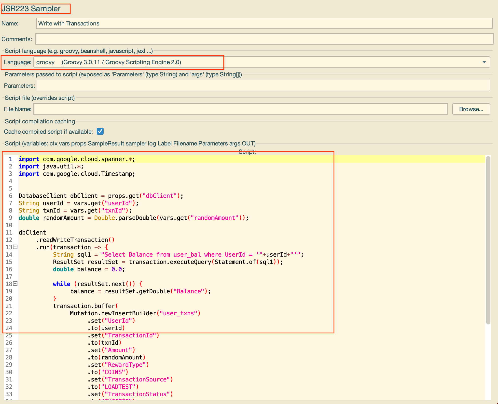
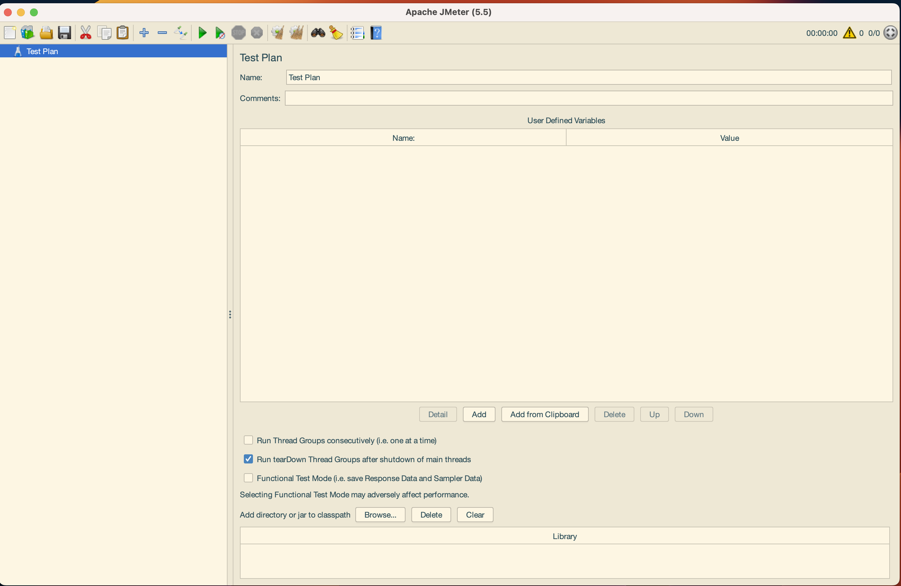
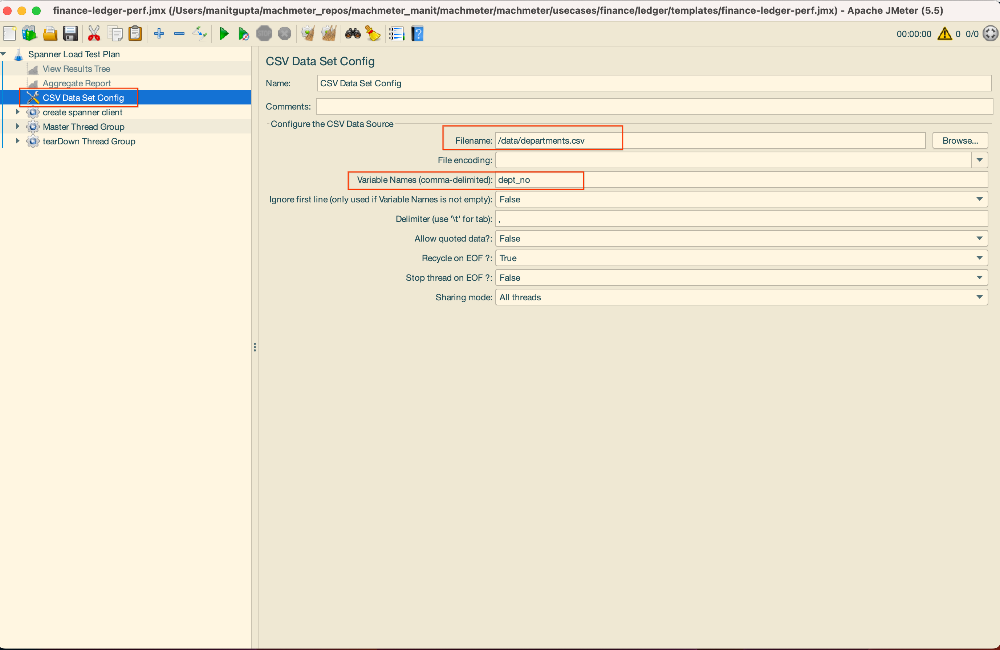
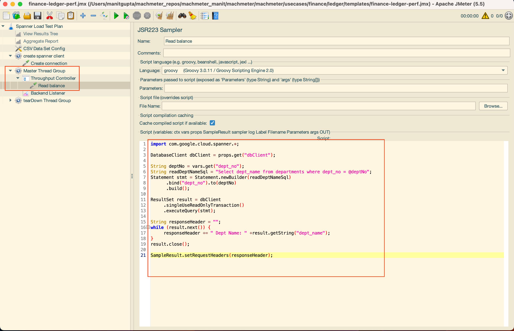

# Part II - Developing a JMeter Template locally
{: .no_toc }
We will use the JMeter GUI to create a JMeter template locally. In order to have a starting point, we will use on
the existing templates in Machmeter to get started. In order to this, we will clone Machmeter, and setup JMeter
and its associated dependencies.
We will then run the JMeter template locally and test that the created data load and performance test templates work.

## Table of contents
{: .no_toc .text-delta }

1. TOC
{:toc}

## Installing JMeter

While Machmeter itself does not require a local Jmeter installation and abstracts out the details of setting up JMeter
from the user, for adding a new template, the JMeter UI is very helpful.

It allows the user to quickly open, edit and test the template before it is run at scale on a GKE cluster.

Let's install JMeter first. On your local machine, do the following -

1. Download and [install](https://jmeter.apache.org/download_jmeter.cgi) JMeter 5.3 or higher, which requires Java 8 or higher.
2. Install [Maven](https://maven.apache.org/install.html), which is used to download Cloud Spanner client libraries.
3. Add an alias to JMeter in your shell config - `alias jmeter='<PATH_TO_JMETER>'`
4. In a command shell, go to an empty directory, where you will keep JMeter dependencies.
5. Download the Cloud Spanner JDBC library and dependencies:
  ```shell
  mvn dependency:get -Dartifact=com.google.cloud:google-cloud-spanner-jdbc:RELEASE -Dmaven.repo.local=.
  ```
5. Move the downloaded JAR files into a folder for JMeter to load in its classpath:
    ```shell
      find . -name *.jar -exec mv '{}' . \;
    ```

{: .note }
We will use the folder class path in the Step 5 above as the location of the JARs that need to be loaded in the 
JMeter template. More on that below.

## Set up authentication for JMeter

JMeter uses Cloud Spanner JDBC client libraries to connect. It supports various authentication mechanisms, including service accappounts.
Since we just want to test our templates, we will use the application default credentials -

```shell
gcloud auth application-default login
```

## JMeter basics
JMeter is a highly configurable tool and has various components from which you can choose. This section provides a basic overview of how to create a JMeter test along with some minimal configurations that you can use as a base for your tests.

### JMeter test plan
JMeter has a hierarchical structure to the tests, with a top node called the test plan. It consists of one or more thread groups, logic controllers, sample generating controllers, listeners, timers, assertions, and configuration elements. Because a test plan is the top-level configuration element, saving a test plan to disk also saves all nested objects, and the resulting file is saved with a .jmx filename extension.

For simplicity, it's sufficient to have the top-level test plan contain a single thread group, which in turn contains one or more samplers. There can be multiple samplers (and other components) within a thread group; each is executed serially per thread.

Test plans and thread groups can also have configuration elements such as a JDBC connection or CSV data reader. Configurations can be shared with child nodes.


### Thread Groups
Thread group elements are the beginning points of any test plan.
The controls for a thread group allow you to:

1. Set the number of threads
2. Set the ramp-up period
3. Set the number of times to execute the test

Each thread will execute the test plan in its entirety and completely independently of other test threads. Multiple threads are used to simulate concurrent connections to your server application.

### Variables, Parameters and User Defined Variables
The User Defined Variables element lets you define an initial set of variables.


JMeter variables are local to each thread. The values may be the same for each thread, or they may be different.
If a variable is updated by a thread, only the thread copy of the variable is changed. Once a thread has started, the initial set of variables (User Defined Variables) is copied to each thread.

User Parameters allows the user to specify values for User Variables specific to individual threads.


### Listeners
You can add an aggregate report (or other types of reports) after all the thread groups. This will show staistics from the JMeter graphical user interface (GUI) in real time for all of the samplers. However, we don't recommend running performance tests in GUI mode, because the JMeter GUI can be slow. You can use it for test development purposes, though.

We recommend running tests in command-line mode, which generates HTML reports with the different JMeter reports.

### JDBC Request Sampler

You can send SQL queries with the JDBC Sampler. Using Prepared Select or Prepared Update is recommended, because it has [better performance](https://cloud.google.com/spanner/docs/sql-best-practices#query-parameters) on Cloud Spanner.


### JSR223 Sampler
The JSR223 Sampler allows JSR223 script code to be used to perform a sample or some computation required to create/update variables.
Since this invokes a Groovy shell, we can script Java code in this sampler to implement custom Cloud Spanner testing logic, such as creating mutations, transactions etc.
We can also read data from a loaded dataset such as a CSV to create requests.



## Modify the Data-Load Template (GUI-mode)

To modify the Data-load template to match our schema, we need to open it in the JMeter GUI. This allows to visually
inspect the Data-load template and make the needed changes.

```shell
jmeter
```

The JMeter GUI boots up. It looks like the following:


Click on the "Open" button in the top-left corner and navigate to the data-load template you want to modify. This will
be at the following location: `machmeter/usecases/erp/employees/templates/data-load.jmx`.

With the template now open, we will start customising it for our use-case.

### Updating the template name

On the first screen (Test Plan), change the name of the Template to `ERP Employees Cloud Spanner Initial Load` and add
an appropriate comment.

### Updating the JAR path location

Since we want to run this template locally, update the location of the JARs to the local destination on your machine.
This is the class path from [Installing Jmeter](#installing-jmeter) section above.

### Updating the data generation logic

Open the `Insert Data` thread group. `Insert Data` is responsible for inserting data into the database. This
contains `JDBC Requests` which have `insert` statements for all the tables needed to be populated. Number of Rows to be
added can be controlled by `users` and `iterations`. `users` control the number of threads. `iterations` control the
number of iterations within a single thread. So, the total rows added will be `users * iterations`.

Note that all the actions inside the "Insert Data" thread group will be performed inside a single transaction. While
modeling your data-load strategy, try to emulate what you would do in application. For example, if you want to insert
data into multiple, unrelated tables, then create multiple thread groups.

For our use-case, let us update the `user_bal insert` `JDBC Request`. To keep things simple, we will show how to insert
data into `departments` table from the `SQL` schema described above. The `JDBC request`, make the following changes:

* Change `Name` to `departments` insert.
* Change the SQL query to `insert into departments (DeptNo, DeptName) values (?,?)`
* Change the Parameter values to `${DeptNo},${DeptName}`
* Change the Parameter types to `VARCHAR,VARCHAR`

The end result should look like so:


Next, we need to define the data generation logic for these fields using the Jmeter in-line functions. Click on
the `User Paremeters` section on the left (below `departments insert)

Update the following:

* DeptNo = `${__RandomString(4,abcdefghijklmnopqrstuvwxyz1234567890)}`
* DeptName = `${__RandomString(35,abcdefghijklmnopqrstuvwxyz1234567890)}`

This will generate random UUIDs for both DeptNo and the DeptName. Delete the existing variables.

{: .note }
There is a `Loop Controller` element also added in the original `financial-ledger` template. This JMeter
element is used to create an iteration-loop within a single instance of thread loop execution. A classic use-case
where this is very useful in the context of Cloud Spanner is interleaving. To generate randomised data which
satisfies an interleaved constraint, the `loop controller` can be used. As this all happens in a transaction, the
data is also committed successfully.

We do not need `Loop Controller` for our use-case, so right-click on it and click 'Remove'.

### Updating the Sampled CSV logic

Once random data has been inserted into Cloud Spanner, we sample the database to fetch a random list of IDs from it.
We do this step to aid our performance testing. Having this list allows us to refer to the existing rows in the
Cloud Spanner database to initiate Point reads, writes, transactions, queries etc.

Inside the `Create Sample CSV Data` thread group, click on `Fetch UserIds`. Change its name to `Fetch DeptNos`.
In both the `JDBC Request` page and
the `JDBC PreProcessor` page, update the `SELECT` query as follows:

```sql
SELECT dept_no FROM departments TABLESAMPLE BERNOULLI (50 PERCENT) limit 50000;
```


In the `JSR223 PreProcessor` page, update the file name to `/departments.csv` from the existing `/userId.csv`.


All the changes to the data-load template are now complete. Click on the "Save" button on the top-pane to save the
template.

## Run the Data load JMeter template locally.

Click on the green arrow on the top navigation bar on the JMeter GUI to start running the template. Once the template
is running, the JMeter output would be visible in the "View Result Tree" tab on the left navigation pane.
Look at the sampler result to determine success/failure of the run. 

For example, in the screenshot below, JMeter is unable to resolve several classes provided by the Cloud Spanner client
library. These exceptions are visible on the UI and the fix would be to update the correct JAR path of the libraries
in the Test Plan tab (Named "Scenario 1 Cloud Spanner Initial Load" in the screenshot).


## Modify the Performance test Template (GUI mode)

To modify the Performance test template to match our schema, we need to open it in the JMeter GUI. This allows to visually
inspect the Performance test template and make the needed changes.

```shell
jmeter
```

The JMeter GUI boots up. It looks like the following:


Click on the "Open" button in the top-left corner and navigate to the data-load template you want to modify. This will
be at the following location: `machmeter/usecases/erp/employees/templates/finance-ledger-perf.jmx`. (You can rename
this file right now or after making all the changes to `erp-employees-perf.jmx`).

With the template now open, we will start customising it for our use-case.

### Updating the template name

On the first screen (Test Plan), change the name of the Template to `ERP Employees Perfomance Test` and add
an appropriate comment.

### Updating the JAR path location

Since we want to run this template locally, update the location of the JARs to the local destination on your machine.
This is the class path from [Installing Jmeter](#installing-jmeter) section above.

### Updating the CSV Dataset Config

In the left-pane, you will notice two `CSV Data Set Config` groups. They element of JMeter allows us to load a
CSV dataset from disk to be used in the performance test. In the Data load section, we had created a CSV file
which would be dumped to the disk with a random sampled list of keys from mock seed data generated. This is the file
that is loaded in this step.

Since just have one CSV for our sample template, delete one `CSV Data Set Config` group. For the other, making the
following changes:

* Modify `Filename` to `/data/departments.csv`
* Modiify `Variable Names (comma-delimited)` to `dept_no`

The final result looks like the following:


### Updating the Master Thread Group

{: .note }
We also have a thread group which creates the Cloud Spanner Java Client. This thread group does not need to edited
for most common scenarios.

The `Master Thread Group` contains all the read/write queries for the test. These can be queries, mutations or transactions.
Inside the `Master Thread Group` you will be multiple `Throughput Controllers`. These controllers control the distribution
of each type of request in the load generated by JMeter. In the current template, sum of the `Throughput` field
in each of the Throughput controllers would sum up ~100%.

For demonstration, we will keep our load test simple, and have a single type of query. It will be a point read with
100% throughput applied to it:

* Delete all other Throughput Controllers expect `Read balance` one.
* Change the `Throughput` to 100.
* In the `JSR223 Sampler` page (`Read balance`) change the name to `Read department number`.
* In the `JSR223 Sampler` page (`Read department number`) replace the existing code with following:

```java
import com.google.cloud.spanner.*;

DatabaseClient dbClient = props.get("dbClient");

String deptNo = vars.get("dept_no");
String readDeptNameSql = "Select dept_name from departments where dept_no = @deptNo";
Statement stmt = Statement.newBuilder(readDeptNameSql)
      .bind("dept_no").to(deptNo)
      .build();

ResultSet result = dbClient
	.singleUseReadOnlyTransaction()
	.executeQuery(stmt);

String responseHeader = "";
while (result.next()) {
	responseHeader += " Dept Name: " +result.getString("dept_name");
}
result.close();

SampleResult.setRequestHeaders(responseHeader);
```

The final result looks like the following:


Save the template with the name `erp-employees-perf.jmx`.

## Run the Data load JMeter template locally.

Click on the green arrow on the top navigation bar on the JMeter GUI to start running the template. Once the template
is running, the JMeter output would be visible in the "View Result Tree" tab on the left navigation pane.
Look at the sampler result to determine success/failure of the run.

For example, in the screenshot below, JMeter is unable to resolve several classes provided by the Cloud Spanner client
library. These exceptions are visible on the UI and the fix would be to update the correct JAR path of the libraries
in the Test Plan tab (Named "Scenario 1 Cloud Spanner Initial Load" in the screenshot).


## Conclusion

At the end of Part II, we have created data load and performance test template for JMeter which have been tested
locally. In [Part I](infra.md), we had created the required infrastructure for doing a load test. In the [Part III](remote-test.md)
we will now perform an at scale load test using Machmeter.