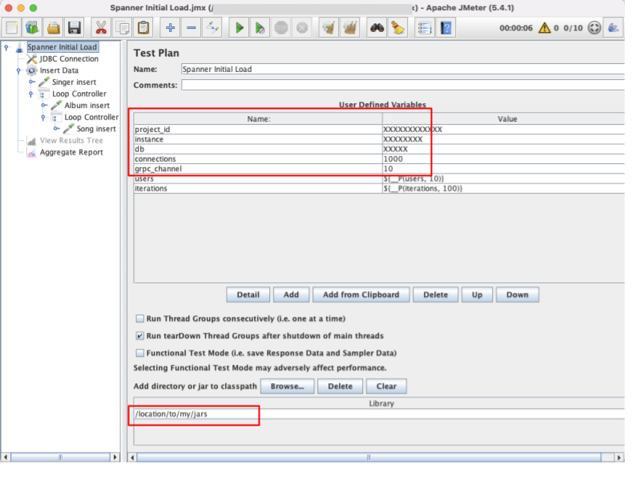

#  Part III - Running templates using Machmeter
{: .no_toc }
Now that we have created the required infrastructure in [Part I](infra.md) and created and executed our templates locally
to ensure that they work in [Part II](local-test.md), we will execute these templates at scale using Machmeter's 
intuitive `execute` CLI command.

## Table of contents
{: .no_toc .text-delta }

1. TOC
{:toc}


## Changes required for Machmeter compatibility

In [Part II](local-test.md), we have updated the location of the JARs to our local filepath to run the templates locally.
We need to revert this change to so that the Jmeter template can find the JARs when running inside a Kubernetes pod.
Machmeter provides these dependencies at the `/test/` location inside the docker image that is deployed to GKE.
Hence, change the location back to `/test/` in the templates. This can be found in "Test plan" screen.



## Run the machmeter `execute` command for Data load

Modify the data-load `JSON` configuration at `sample-configs/data-load.json` to update the `jMeterTemplatePath`
, `instance`
and `database` configurations.

Then run the following:

```bash
$ java -jar target/machmeter/machmeter.jar execute sample-configs/data-load.json
```

Machmeter will bootstrap the template on the GKE cluster and start the execution with the parameters supplied in the
`JSON` file above.

## Run the machmeter `execute` command for Performance Test

Modify the perf-test JSON configuration at `sample-configs/perf-test.json` to update the `jMeterTemplatePath`, `instance` and `database` configurations.

Then run the following:
```shell
$ java -jar target/machmeter/machmeter.jar execute sample-configs/perf-test.json
```

Machmeter will bootstrap the template on the GKE cluster and start the execution with the parameters supplied in the JSON file above.

## Observe metrics at Client side

{: .note }
Client side metrics aggregation can consume significant resources on the GKE cluster as the size of the load test
increases. We recommend disabling the `backend listener` in the JMeter templates when targeting QPS generation
requirements in excess of >20K.

Machmeter records telemetry from JMeter and shows the client side metrics on a Grafana dashboard. Grafana runs
inside a separate pod in the GKE cluster. We can simply connect to it to view the dashboard -

```shell
gcloud container clusters get-credentials <CLUSTER_NAME> --region=<REGION>
kubectl port-forward -n <NAMESPACE> $(kubectl get po -n <NAMESPACE> | grep jmeter-grafana | awk '{print $1}') 3001:3000
```


## Observe metrics at Server side

Spanner provides several metrics such as [Instance Metrics](https://cloud.google.com/spanner/docs/monitoring-console)
, [Transaction Insights & Lock Insights](https://cloud.google.com/spanner/docs/use-lock-and-transaction-insights)
and [Query insights](https://cloud.google.com/spanner/docs/using-query-insights) to
understand how Cloud Spanner is performing under the active load.

## Commit the templates

Once both the SQL schema, Data load and Performance test templates are all working as expected, please commit them
to the main repository by creating
a [Pull request](https://docs.github.com/en/pull-requests/collaborating-with-pull-requests/proposing-changes-to-your-work-with-pull-requests/creating-a-pull-request-from-a-fork)
.